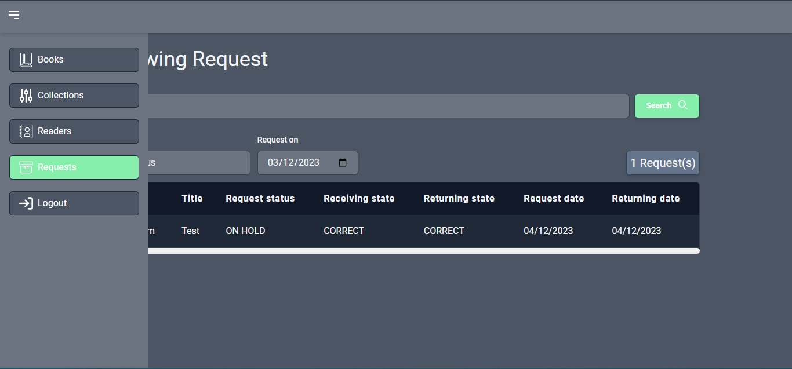
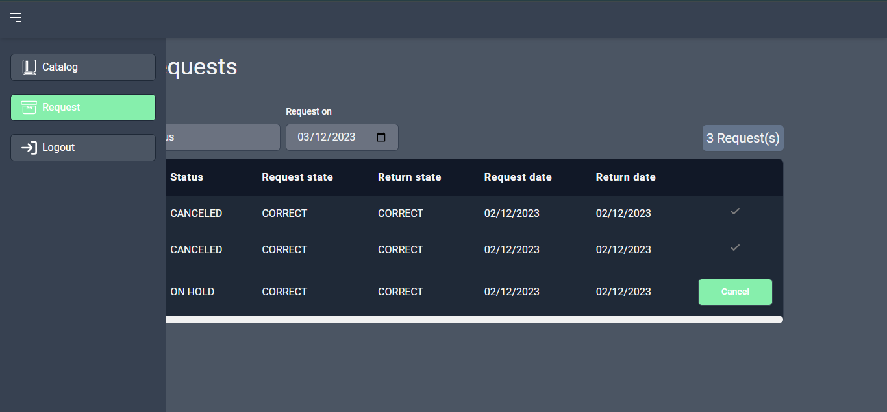

# GUID D'UTILISATION

## Execution

> ## Prérequis
>
> > -   Node js
> > -   Git

> ## Commandes (A executer dans cet ordre)
>
> > -   git clone https://github.com/FlorientManfo/Vue-Express.git
> > -   cd back-end
> > -   npm i
> > -   npm run dev
> > -   cd ../front-end
> > -   npm i
> > -   npm run dev

## Fonctionnalités

Le projet dispose de fonctionnalités dédiées au profil **Administrateur** et **Lecteur**

> ## Administrateur
>
> En tant qu'administrateur, je peux :
>
> -    Me connecter (email: Admin@admin.com, mot de passe: Admin@007)
> -   Enregistrer un ou plusieurs livres simultanément en cliquant sur le bouton ajouter depuis la liste des livres puis completer le formulaire
> -   Éditer les information d'un livre
> -   Créer une nouvelle collection de livre depuis le menu Collection
> -   Consulter la liste de lecteurs depuis le menu **Readers**
> -   Consulter la liste des requêtes d'emprunt depuis le menu **Requests**
> -   Filtrer la liste des requêtes par lecteur ou date d'émission
> -   Modifier le status d'une requête (Validé, Livre à retourné, Livre retourné)
> -   Me déconnecter depuis l'option **Logout** du menu

> ## Lecteur
>
> En tant que lecteur, je peux:
>
> -   Me connecter ou créer un nouveau compte lecteur
> -   Consulter le catalogue de livres
> -   Émettre une demande d'emprunt pour exemplaire du catalogue en cliquant le button emprunter
> -   Consulter le status de mes demande d'emprunt depuis le menu **Requests**
> -   Annuler une request en cliquant sur le bouton **Cancel** sur la liste des requêtes
>     \*Filtrer la liste des requêtes par titre ou par date d'émission
> -   Me déconnecter depuis l'option **Logout** du menu

> ## Fonctionnalité générale
>
> De manière générale, l'application est responsive avec un thème adaptatif (Sombre et Claire) 🥲

## Licence

Copyright © 2023 <the owner>. All rights reserved.
